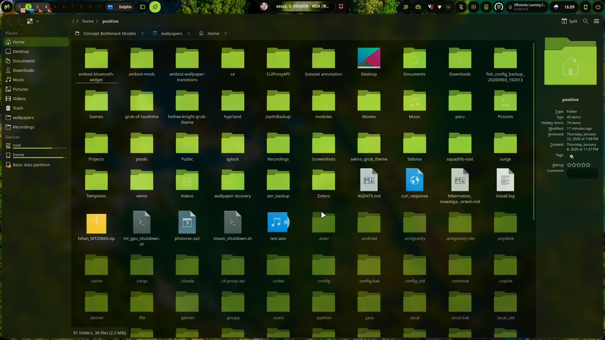

# Theme Sync for Ambxst

[](https://github.com/Axenide/Ambxst)
[](ambxst.mod.json)
[](LICENSE)

Syncs the wallpaper's Material You palette live, with no restarts, to:

- **Kitty** (via `kitten @ set-colors` + SIGUSR1 fallback)
- **btop**, **Starship**, **Fastfetch**
- **Spotify** (via Spicetify)
- **Fuzzel**
- **Sonora**
- **Dolphin / KDE apps** — a generated Material You color scheme + icon theme, applied live via a "ping-pong" `plasma-apply-colorscheme` trick (no `plasmashell` daemon needed) plus D-Bus signals so `KIconLoader`/`KConfigWatcher` pick it up without restarting Dolphin

Every app above can be individually toggled off from Ambxst's Settings, and Dolphin additionally gets **opacity** and **blur** sliders — independent of whether Dolphin's colors are synced — so you can dial in your own amount of transparency without forking the mod.

**None of these overwrite your own config beyond colors** (`v1.0.1`):
- **Starship**: colors flow through Kitty's own ANSI palette (indices 236-239, 250, 252, 255) — `KittyTarget` keeps those live-synced every wallpaper change, and Starship's `bg:237`/`fg:255`-style references pick them up automatically at render time. So `starship.toml` is written **once**, on first sync if it doesn't already exist, and never touched again — edit it freely afterward.
- **Fuzzel**, **Spicetify**: only the `[colors]` / `[Ambxst]` section is ever touched; font, layout, prompt symbol, dimensions, and anything else you've set stays exactly as you left it.
- **btop**, **Fastfetch**, **Dolphin**: only specific keys are patched in place (`color_theme`, a couple ANSI index refs, `AccentColor`/icon theme) — never a full-file rewrite.
- **Kitty**, **Sonora**: colors live in their own dedicated file/JSON section, included/read separately from your main config.

If you're upgrading from `v1.0.0` and already have a `starship.toml`/`fuzzel.ini` that got clobbered, re-run `scripts/install.sh` (or just copy the updated `targets/starship.py` and `targets/fuzzel.py` into `~/.config/ambxst-sync/targets/`) — the *next* sync will leave them alone from then on.

## Screenshot

Dolphin's icons, header, and selection colors synced live to a green wallpaper, with the default 89% opacity + blur rice:



## Settings (Ambxst → Settings → Mods → Theme Sync)

| Setting | Default | Notes |
|---|---|---|
| Sync Kitty / btop / Starship / Fastfetch / Spicetify / Fuzzel / Sonora | On | Per-app on/off |
| Sync Dolphin colors | On | Applies the generated color scheme. Off leaves Dolphin's own theme untouched — opacity/blur below still apply either way, since those are a window-compositing preference, not a color |
| Dolphin icon theme | Breeze Dark | Breeze Dark / Breeze / Breeze Light |
| Dolphin window opacity | 89% | 40–100%. Inactive-window opacity trails 6 points below |
| Blur behind Dolphin | On | Uses your compositor's existing Kawase blur config |

## Install

```bash
ambxst mods install https://github.com/POSiTiiiV/ambxst-mods/tree/main/packages/theme-sync
ambxst mods enable positive.theme-sync
ambxst reload
```

This installs the small QML service that reacts to the settings above. The actual sync engine is a Python coordinator + systemd service that watches `~/.cache/ambxst/colors.json` — Ambxst mods can only patch Ambxst's own QML source, not install arbitrary background services, so that part needs one manual script run:

```bash
git clone https://github.com/POSiTiiiV/ambxst-mods.git
./ambxst-mods/packages/theme-sync/scripts/install.sh
```

(If you installed the mod via the GUI/CLI installer instead of a local clone, grab just this one script from the repo above — everything it needs is bundled under `scripts/`.)

This installs the coordinator to `~/.config/ambxst-sync/`, `dolphin-apply-color.py` to `~/.local/bin/`, a systemd user path+service unit that watches for wallpaper changes, seeds `~/.config/ambxst/mods/positive.theme-sync.json` with defaults, configures Kitty's live theme include and opacity, and injects the required Dolphin & Kitty frosted glass rules into `~/.config/hypr/lua/custom/custom_rules.lua`. It requires `plasma-apply-colorscheme` and `busctl` (from KDE Frameworks / plasma-workspace) to be installed already, and prints an error naming what's missing if not.


## How it works

- `~/.local/bin/ambxst-theme-sync` (symlinked to the coordinator) is triggered two ways: a systemd `.path` unit watching `colors.json` (wallpaper changes), and this mod's `ThemeSyncService.qml` re-running it whenever you change a setting in Ambxst.
- The coordinator reads `~/.config/ambxst/mods/positive.theme-sync.json` for the per-app toggles and Dolphin settings, then dispatches to each app's `targets/*.py` in parallel.
- Dolphin's opacity/blur settings are written to `~/.config/hypr/lua/generated/theme-sync-rice.lua` and applied with `hyprctl reload` — independent of the color sync, so it runs every time regardless of the "Sync Dolphin colors" toggle.

## License

MIT © [POSiTiiiV](https://github.com/POSiTiiiV)
