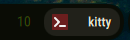

# Workspace App Indicator for Ambxst

[](https://github.com/Axenide/Ambxst)
[](ambxst.mod.json)
[](LICENSE)

Shows the focused app's icon and name in a small badge next to the workspace row — as a **separate element**, never fused into the workspace number pill itself (the pill stays the same size/shape regardless of what's focused).

Works for both regular and special (isolated) workspaces: when a [`positive.special-workspaces`](https://github.com/POSiTiiiV/ambxst-mods/tree/main/packages/special-workspaces) workspace is open, the badge follows whatever's actually focused inside it live — e.g. switching focus between Discord and a terminal both open in the same special workspace updates the badge instantly, using Quickshell's native toplevel tracking rather than the compositor's own window-list snapshot (which can lag a pure focus-only change).

Falls back to a workspace-name-derived label/icon (e.g. "Music", "Discord") when a special workspace is open but empty.

Requires [`positive.special-workspaces`](https://github.com/POSiTiiiV/ambxst-mods/tree/main/packages/special-workspaces) (for special-workspace state) — which in turn requires [`positive.dock-enhancements`](https://github.com/POSiTiiiV/ambxst-mods/tree/main/packages/dock-enhancements).

## Screenshot



## Installation

```bash
ambxst mods install-dependencies positive.workspace-app-indicator  # pulls in special-workspaces + dock-enhancements
ambxst mods install https://github.com/POSiTiiiV/ambxst-mods/tree/main/packages/workspace-app-indicator
ambxst mods enable positive.workspace-app-indicator
ambxst reload
```

Or via the GUI: **Ambxst Settings → Mods → Package source**, paste the package URL, **Install**, then enable it (and its dependencies) in the list.

## License

MIT © [POSiTiiiV](https://github.com/POSiTiiiV)
